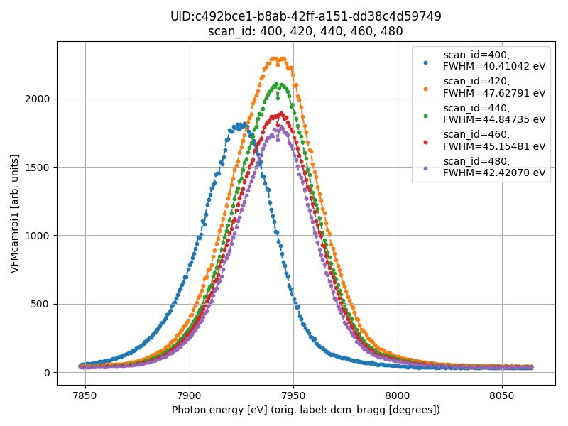

# databroker-extractor - tools and utilities for experiments

The tools are used to obtain data from beamline databroker servers and perform initial data analysis
(e.g., calculation of the FWHM of the undulator harmonics).

### Installation instructions:

Install miniconda from https://conda.io/miniconda.html. Then create the environment for databroker:
```bash
conda create --name databroker python=3.6 numpy scipy matplotlib
activate databroker
pip install -r https://raw.githubusercontent.com/mrakitin/databroker-extractor/master/requirements.txt
pip install git+https://github.com/mrakitin/databroker-extractor
```

### Remote access to data from NSLS-II beamlines using databroker.

Access DataBroker data from outside the gateway:
- Prepare the SSH config file, e.g.:
```bash
$ cat ~/.ssh/config
Host chx-srv1
    User mrakitin
    Hostname xf11id-srv1
    LocalForward 27011 localhost:27017
    ProxyCommand ssh mrakitin@box64-3.nsls2.bnl.gov nc %h %p 2> /dev/null
```

- Create `/XF11ID/data/` dir on a local machine and make a current user/group to own the dir.

- Datastore/filestore are configured automatically, e.g. for 5-ID (SRX) the forwarded port is 2700**5**, for 11-ID (CHX) - 270**11**, for 12-ID (SMI) - 270**12**.

- Make a tunnel to go through a firewall on Linux:
```bash
ssh -fN -o ExitOnForwardFailure=yes chx-srv1 2>/dev/null && sshfs mrakitin@chx-srv1:/XF11ID/data /XF11ID/data/
```

- Make a tunnel to go through a firewall on Windows (with installed PuTTY+Plink) - execute the following batch files:
  - [CHX_xf11id-srv1.bat](https://github.com/mrakitin/databroker-extractor/blob/master/utils/CHX_xf11id-srv1.bat)
  - [SMI_xf12id-ca1.bat](https://github.com/mrakitin/databroker-extractor/blob/master/utils/SMI_xf12id-ca1.bat)
  - [SRX_xf05id-ca1.bat](https://github.com/mrakitin/databroker-extractor/blob/master/utils/SRX_xf05id-ca1.bat)

- Use earlier defined conda environment or use one from the databroker tutorial - https://github.com/NSLS-II/broker-tutorial.

- Run the script to collect data:

SMI:
```bash
$ databroker-extractor -b smi -s 400 420 440 460 480 -e  # saves data and plots for the provided scans
```
```bash
$ databroker-extractor -b smi -p 400 420 440 460 480 -e  # plots data for the provided scans
```


CHX:
```bash
$ databroker-extractor -b chx -p 19008 19010 19021 19023 -e
```


SRX:
```bash
$ databroker-extractor -b srx -p 029c0d3a 705980d9 82337021 a0d35aba 54032db3 7355ac61 96957282 83d5c99d c727d916 -e
```

