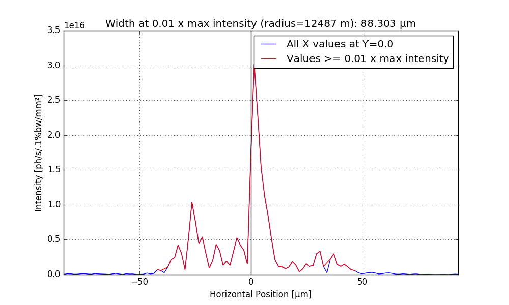
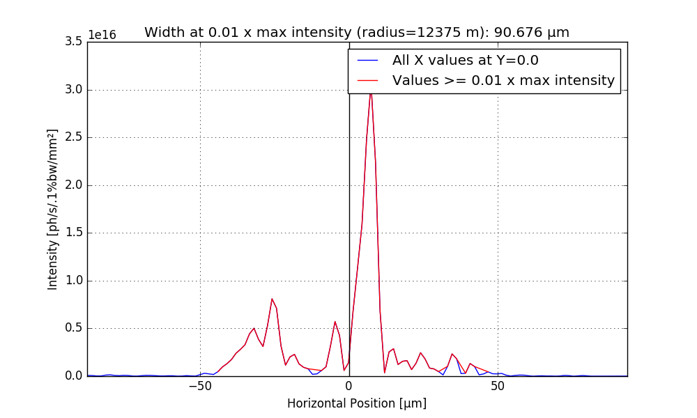

The module is to perform series of the SRW simulations of the SRX beamline @ NSLS-II
with different radii of the spherical mirror to find the best radius of curvature 
producing the smallest horizontal focus.

**Author:** Maksim Rakitin, BNL (based on O.Chubar's script).

**Date:** 2016-08-15/16

**Results:**

- Aperture - fully open (2.5 mm):
 - the smallest focus size: 88.303 μm;
 - radius: 12487 m.

- Aperture - 1.0 mm:
 - the smallest focus size: 90.676 μm;
 - radius: 12375 m.

- Aperture - 0.5 mm:
 - the smallest focus size: 88.106 μm;
 - radius: 12816 m.

